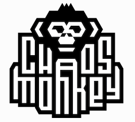
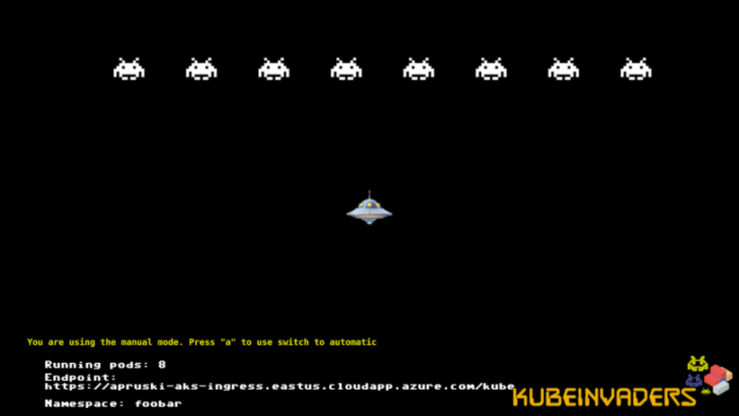

# Chaos Engineering

---

## Andrew Pruski

### Field Solutions Architect
#### Microsoft Data Platform MVP 
#### Docker Captain
#### VMware vExpert

<!-- .slide: style="text-align: left;"> -->
<i class="fa-brands fa-bluesky"></i><a href="https://bsky.app/profile/dbafromthecold.com">  @dbafromthecold.com</a> 
<i class="fas fa-envelope"></i>  dbafromthecold@gmail.com 
<i class="fab fa-wordpress"></i>  www.dbafromthecold.com 
<i class="fab fa-github"></i><a href="https://github.com/dbafromthecold">  github.com/dbafromthecold</a>

---

### Session Aim
<!-- .slide: style="text-align: left;"> -->
An overview of Chaos Engineering and how it can be applied

---

# Chaos Engineering?

---

### What is Chaos Engineering?
<!-- .slide: style="text-align: left;"> -->
"Chaos Engineering is the discipline of experimenting on a system in order to build confidence in the system's capability to withstand turbulent conditions in production" 
<a href="principlesofchaos.org">principlesofchaos.org</a>

---

### What Chaos Engineering is not!
<!-- .slide: style="text-align: left;"> -->
<ul>
<li class="fragment">Breaking things in production!</li>
<li class="fragment">Staging or Production?</li>
<ul>

---

# Chaos Engineering Implementations

---

### Netflix - Chaos Monkey
<!-- .slide: style="text-align: left;"> -->

"Chaos Monkey is responsible for randomly terminating instances in production to ensure that engineers implement their services to be resilient to instance failures" 
<a href="netflix.github.io/chaosmonkey/">netflix.github.io/chaosmonkey</a>

---

### Other Implementations
<!-- .slide: style="text-align: left;"> -->
<i class="fab fa-slack"></i><b> Slack - Disasterpiece Theatre</b>

&#9;- Planned failure exercises 
&#9;- Group of engineers working together 
&#9;- Run in development then production to build confidence

<i class="fab fa-google"></i><b> Google - DiRT</b>

&#9;- Disaster recovery testing 
&#9;- "Hope is not a strategy" - SRE Team motto 
&#9;- Automated and manual tests 
&#9;- Controlled Chaos

---

# Getting Started

---

### Environment Analysis

<!-- .slide: style="text-align: left;"> -->
<ul>
<li class="fragment">Infrastructure</li>
    <ul>
        <li class="fragment">Cloud, private data centre?</li>
    </ul>
<li class="fragment">Applications</li>
    <ul>
        <li class="fragment">What's hitting our SQL instances?</li>
    </ul>
<li class="fragment">Monitoring</li>
    <ul>
        <li class="fragment">How are we going to analyse the results of our experiments?</li>
    </ul>
<li class="fragment">Social</li>
    <ul>
        <li class="fragment">How do people react to systems going down?</li>
    </ul>
</ul>

---

### Past Incident Analysis
<!-- .slide: style="text-align: left;"> -->
How has the system failed previously? 
What technologies/strategies are now in place? 
What was learnt from those previous failures? 

---

<svg viewBox="-100 0 820 560" width="760" height="560" xmlns="http://www.w3.org/2000/svg" role="img" aria-label="Likelihood vs Impact risk matrix">
  <!-- background -->
  <rect x="-100" y="0" width="920" height="560" fill="#0e4650"/>

  <!-- title -->
  <text x="380" y="70" text-anchor="middle"
        font-family="Inter, system-ui, -apple-system, Segoe UI, Roboto, Helvetica, Arial, sans-serif"
        font-size="48" font-weight="800" letter-spacing="2"
        fill="#ffffff">Likelihood-Impact Map</text>

  <!-- matrix frame -->
  <g transform="translate(110,130)">
    <!-- outer border -->
    <rect x="0" y="0" width="540" height="400" fill="none" stroke="#e5e7eb" stroke-width="2"/>

    <!-- grid (dashed) -->
    <g stroke="#e5e7eb" stroke-dasharray="4 6" opacity="0.7">
      <!-- verticals -->
      <path d="M0 0 V400"/>
      <path d="M108 0 V400"/>
      <path d="M216 0 V400"/>
      <path d="M324 0 V400"/>
      <path d="M432 0 V400"/>
      <path d="M540 0 V400"/>
      <!-- horizontals -->
      <path d="M0 0 H540"/>
      <path d="M0 100 H540"/>
      <path d="M0 200 H540"/>
      <path d="M0 300 H540"/>
      <path d="M0 400 H540"/>
    </g>

    <!-- cells -->
    <!-- Row 1 (top) -->
    <rect x="0"   y="0"   width="108" height="100" fill="#fff176"/>
    <rect x="108" y="0"   width="108" height="100" fill="#fff176"/>
    <rect x="216" y="0"   width="108" height="100" fill="#fff176"/>
    <rect x="324" y="0"   width="108" height="100" fill="#e53935"/>
    <rect x="432" y="0"   width="108" height="100" fill="#e53935"/>
    <!-- Row 2 -->
    <rect x="0"   y="100" width="108" height="100" fill="#fff176"/>
    <rect x="108" y="100" width="108" height="100" fill="#fff176"/>
    <rect x="216" y="100" width="108" height="100" fill="#fff176"/>
    <rect x="324" y="100" width="108" height="100" fill="#fff176"/>
    <rect x="432" y="100" width="108" height="100" fill="#e53935"/>
    <!-- Row 3 -->
    <rect x="0"   y="200" width="108" height="100" fill="#00c853"/>
    <rect x="108" y="200" width="108" height="100" fill="#fff176"/>
    <rect x="216" y="200" width="108" height="100" fill="#fff176"/>
    <rect x="324" y="200" width="108" height="100" fill="#fff176"/>
    <rect x="432" y="200" width="108" height="100" fill="#fff176"/>
    <!-- Row 4 (bottom) -->
    <rect x="0"   y="300" width="108" height="100" fill="#00c853"/>
    <rect x="108" y="300" width="108" height="100" fill="#00c853"/>
    <rect x="216" y="300" width="108" height="100" fill="#fff176"/>
    <rect x="324" y="300" width="108" height="100" fill="#fff176"/>
    <rect x="432" y="300" width="108" height="100" fill="#fff176"/>
  </g>

  <!-- axis labels -->
  <text x="380" y="530" text-anchor="middle"
        font-family="Inter, system-ui, -apple-system, Segoe UI, Roboto, Helvetica, Arial, sans-serif"
        font-size="22" fill="#eadfcb">Impact</text>

  <text x="-70" y="330"
        transform="rotate(-90,-70,330)"
        text-anchor="middle"
        font-family="Inter, system-ui, -apple-system, Segoe UI, Roboto, Helvetica, Arial, sans-serif"
        font-size="22" fill="#eadfcb">Likelihood</text>
</svg>

---

### Potential scenarios to test!
<!-- .slide: style="text-align: left;"> -->

TBD

---

### Defining an experiment
<!-- .slide: style="text-align: left;"> -->
Which failure has the highest likelihood? 
Which failure has the highest impact? 
What will you gain from testing that failure? 
Is there anything else that can be tested?

---

## Example implementation

---

# SQL Server running on Kubernetes

---

### What is Kubernetes?
<!-- .slide: style="text-align: left;"> -->
"Kubernetes is a portable, extensible open-source platform for managing containerized workloads and services, that facilitates both declarative configuration and automation. It has a large, rapidly growing ecosystem. Kubernetes services, support, and tools are widely available" 
<a href="kubernetes.io">kubernetes.io</a>

---

### KubeInvaders

---

# Demo

---

## Resources
<!-- .slide: style="text-align: left;"> -->
TBD
